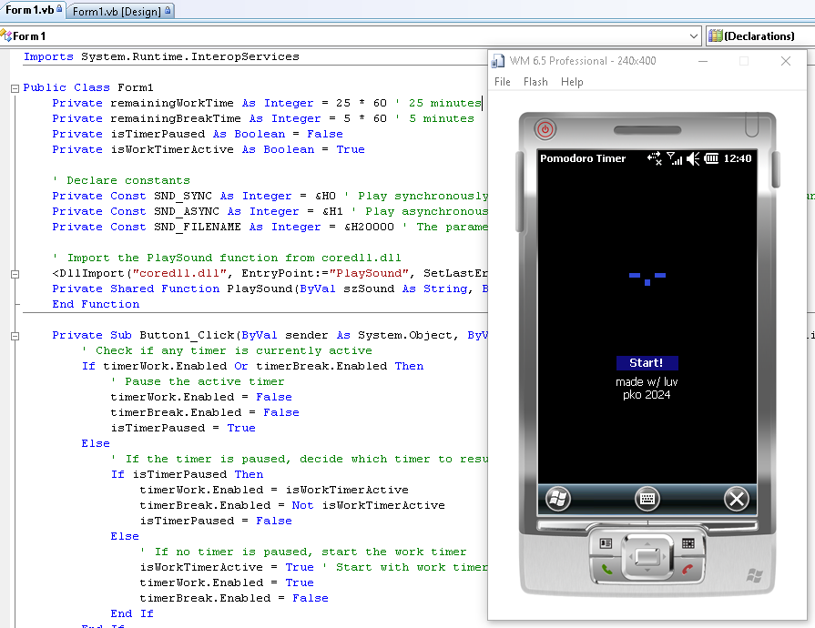

# Windows-Mobile-6.5-Pomodoro-Timer

このプロジェクトは、Windows Mobile 6.5用のスタイリッシュなポモドーロタイマーアプリです。効率的に時間を管理し、生産性を高めるためのシンプルで使いやすいアプリケーションです。休憩時間と作業時間を設定して、一日中集中力を保つことができます。

---

`Visual Studio 2008 と Windows Mobile 6.5.3 Professional DKT は必要だ`

## 特徴 ✨

- **シンプルなUI**: 直感的で使いやすいインターフェイス。
- **通知とアラーム**: タイマーの終了時には視覚的および音声通知を提供。

## スクリーンショット

## 使用方法 🔧

- 「Start」をタッチして、タイマーを始まって！
